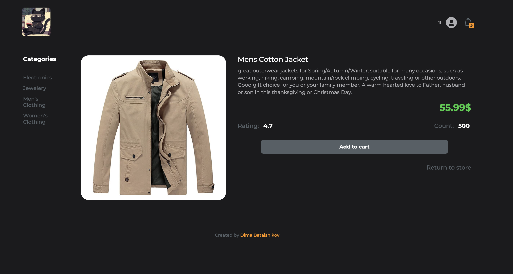

# Project under refactoring. 
### Take my apologies, updated version will be upcoming soon 😉
Main goal: Create Demo Shopping store based on <https://fakestoreapi.com> API Service

---
### Project stack: 
- Vite
- React
- React Router DOM
- TypeScript
- Redux
### Style: 
 - CSS.MODULES



#### How to start demo:
1. Navigate to project folder and install dependencies
```
npm i
```
2. Using Terminal add command to run the DEV Server localy
```
npm start
```
3. !important. To add products in the Cart, User should be Logined (Registered in the App via form)
    - To Register in demo <https://fakestoreapi.com> API Service just Click on App User icon
    - Register form Will appear and you can proceed with registration
    - Provide any Name, Email, Password
    - After User ID Will appear in the header, near user icon 🙂

    After short and fast registration please try to add several products to cart^ it will count quantity.
---
Components under development:
- Categories
- Cart
- User Login
- Profile
---

For testing purpose I configure Vite "Proxy" to reach origin FakeStore API and check list of products

How to check origin service indicated below:

- while running app just add to the url path `/api/products`
- URL example: <http://localhost:5173/api/products>

> Please be carful and check PORT before copy link below
> Vite could start server on other Localhost port if 5173 is already in use
